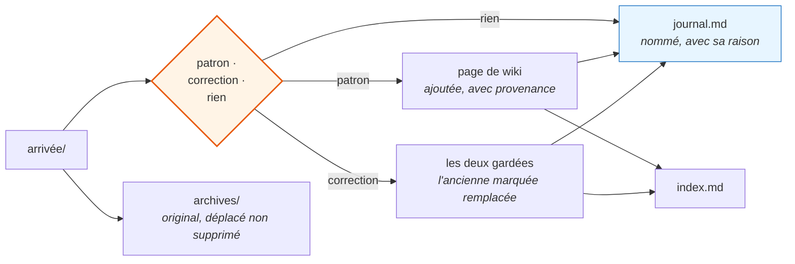

# 04 · La compétence de tri

C'est le mécanisme qui transforme la matière collectée en connaissance et, plus
souvent, qui la refuse. Ci-dessous, la compétence telle qu'elle tourne — pas sa
description.

Son travail est volontairement étroit : lire ce qui est arrivé, décider ce que
c'est, écrire les survivants dans le wiki, et consigner chaque verdict, refus
compris.

---

## Pourquoi une compétence et non une instruction

Trois propriétés qu'une instruction dans le fichier toujours chargé ne peut pas
lui donner.

**Elle ne coûte rien au repos.** Seule la description occupe le contexte. La
procédure ci-dessous — environ 900 mots — se charge quand la compétence tourne et
est absente le reste du temps.

**Elle ne peut pas démarrer d'elle-même.** La compétence déclare
`disable-model-invocation: true`. Elle déplace des fichiers et modifie des pages
durables : elle tourne quand on le demande, jamais de sa propre initiative. C'est
la différence entre un outil et un processus qui réorganise discrètement votre
connaissance pendant que vous pensez à autre chose.

**Elle est auditable.** La procédure est un fichier. Quand le tri se met à produire
de mauvais jugements, il existe un texte précis à corriger, et la correction
s'applique dès l'exécution suivante — sans réentraînement, sans archéologie
d'invite.

---

## La compétence

<details>
<summary><b>Source complète — cliquer pour déplier</b></summary>

```markdown
---
name: learn
description: Traiter la matière déposée dans connaissance/arrivee et intégrer au
  wiki ce qui mérite d'être gardé. Trancher chaque élément, refuser la plupart à
  voix haute, et consigner chaque verdict.
disable-model-invocation: true
---

# /learn

La matière arrive dans `connaissance/arrivee` — articles, exports,
transcriptions, et des liens dans `arrivee/liens.md`. Ceci en transforme une
partie en connaissance et refuse le reste.

## Pour chaque élément

### 1 · Le lire, puis classer honnêtement

- **Un patron qui fonctionne** — quelqu'un l'a fait tourner en production et dit
  comment, y compris ce qui le contraint.
- **Une correction utile** — cela contredit quelque chose que le wiki contient.
- **Rien** — un réchauffé, une liste, du matériel promotionnel, ou déjà couvert.

### 2 · Si c'est rien, le dire et n'ajouter rien

Nommer le fichier et donner une ligne de raison. À voix haute, dans le rapport,
pas en silence.

Une base de connaissance qui accepte tout est un dépotoir, et un dépotoir est
pire qu'un dossier vide parce qu'il ressemble à un actif. Refuser est le travail
principal, pas un échec.

### 3 · Si cela mérite d'être gardé, l'écrire dans le wiki

Préférer l'ajout à une page existante à la création d'une nouvelle. Peu de pages
épaisses valent mieux que beaucoup de pages minces : des contraintes liées qui
vivent séparément se contredisent en silence.

Ne garder que ce qui est actionnable — le patron, les contraintes qui le rendent
sûr, récupérable et observable, et là où il ne s'applique pas. Pas un résumé de
l'article. Deux paragraphes suffisent en général.

Chaque entrée porte :

    source:      auteur + lieu de publication
    as_of:       la date de la matière, pas aujourd'hui
    source_type: primaire | secondaire

La matière secondaire ne tranche jamais une décision à elle seule.

Si une affirmation contredit une page existante, ne pas écraser en silence.
Garder les deux, marquer l'ancienne remplacée, et dire laquelle l'emporte et
pourquoi.

### 4 · Déplacer l'original vers archives/

Déplacé, jamais supprimé. Une affirmation contestée doit rester traçable
jusqu'à sa source.

### 5 · Mettre à jour index.md

Une ligne par page, groupée par la question à laquelle elle répond, avec la
date.

## Rendre compte — toujours ces trois colonnes

| Matière | Verdict | Où |

Puis une ligne par élément refusé disant pourquoi. Puis le nombre de pages.
Rien d'autre.

Ajouter une ligne par élément dans `connaissance/journal.md`. Ne jamais
réécrire ce fichier.

## Dire quand la connaissance sert

Quand une page du wiki oriente une décision pendant le travail ordinaire, la
nommer en une ligne : `d'après wiki/<page>`. Si le dépôt contredit une page,
le dépôt l'emporte. Le dire, et corriger la page dans la foulée.
```

</details>

---

## Les trois parties qui font le travail

### Le classement à trois issues

La plupart des systèmes d'arrivée ont deux issues : garder ou ignorer. Ignorer est
silencieux, donc on n'en apprend rien et la même matière revient au trimestre
suivant.

Ici la troisième issue est **un produit** : nommée, avec sa raison, écrite au
journal. Environ deux tiers de la bonne matière y finissent. Un passage récent sur
trois articles a donné un patron complet, une seule idée gardée, et un refus total
— consigné avec la phrase *« une liste d'outils avec des compteurs d'étoiles,
aucune mesure, et pas un seul cas où l'outil ne convenait pas. »*

Cette phrase vaut plus que l'article ne valait.

### La provenance, imposée à l'écriture

`as_of` est le champ qu'on saute et celui qui fait vieillir le dépôt. Un patron
juste pour une génération de modèle est souvent un échafaudage autour d'une limite
qui n'existe plus. Une connaissance sans date ne peut pas être retirée, donc elle
ne l'est jamais.

`source_type` porte une règle ferme : **la matière secondaire ne tranche jamais
une décision à elle seule.**

### Le traitement des contradictions

L'instruction est explicite : ne pas écraser en silence. Garder les deux
affirmations, marquer l'ancienne remplacée, dire laquelle l'emporte et pourquoi.

Cela coûte un paragraphe et achète la capacité d'annuler la décision plus tard. Le
raisonnement est la partie durable — la prochaine contradiction en aura besoin, et
d'ici là personne ne se souviendra de quoi parlait la première.

---

## À quoi ressemble la boucle en pratique



---

## La clause qui rend tout cela visible

La dernière section de la compétence est celle que je garderais s'il fallait
supprimer le reste :

> Quand une page du wiki oriente une décision pendant le travail ordinaire, la
> nommer en une ligne. Si le dépôt contredit une page, le dépôt l'emporte.

Une connaissance rangée mais jamais visiblement utilisée ne peut pas être évaluée,
et une base non évaluée cesse discrètement d'être entretenue — personne ne décide
de l'abandonner, on arrête simplement de l'ouvrir. Exiger que l'assistant dise
*« d'après wiki/cost-governance »* à voix haute transforme le dépôt en quelque
chose dont la valeur s'observe, et fait remonter les pages périmées dès qu'elles
contredisent le code.

---

**Voir aussi :** [03 · Architecture de la mémoire](03-architecture-memoire.md)
