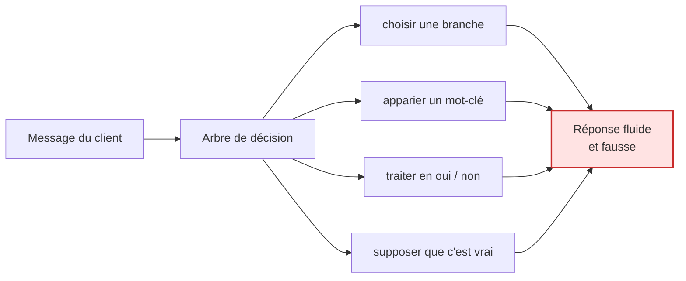

# 02 · Pourquoi un robot à scénarios échoue ici

Le module ressemble à une bulle de clavardage, alors on suppose que le travail
derrière consiste à écrire des réponses et à les brancher sur des boutons. C'est
cette supposition qui produit les projets que le client débranche discrètement au
bout de deux mois.

Voici quatre classes de message tirées du flux réel, anonymisées. Chacune brise
un arbre de décision, et chacune le brise à un endroit différent.

---

## Classe 1 · Deux questions dans une phrase, dont une sous-entendue

> *« Auriez-vous quelque chose pour un portable de 15 pouces et une boîte à
> lunch, pour mon gars, il marche à l'école l'hiver. »*

Un arbre de décision doit choisir une branche. Quelle qu'elle soit, il jette le
reste de la phrase.

Il y a ici quatre contraintes et deux seulement sont formulées comme des
questions. « Pour mon gars » restreint la gamme. « Il marche à l'école l'hiver »
est une exigence de robustesse et de météo que le client ignore avoir posée :
pour lui c'est du contexte, et il serait surpris d'apprendre que cela change la
réponse.

**Ce qui casse :** le choix de branche. L'arbre est structurellement à voie
unique et le message ne l'est pas.

**Ce qu'il faut à la place :** extraire un *ensemble* de contraintes d'une phrase,
puis chercher ce qui les satisfait toutes — et dire laquelle a forcé la
recommandation, pour que le client puisse corriger celle qu'on a devinée.

---

## Classe 2 · La question n'est pas dans le vocabulaire du catalogue

> *« Est-ce que ça survit à un adolescent ? »*

Il n'existe aucun champ pour cela. Aucun mot-clé ne correspond. Un système de
récupération qui note le recoupement de mots-clés ne rend rien, et le robot à
scénarios tombe sur « je n'ai pas compris, reformulez » — ce que le client lit
correctement comme *cette affaire-là ne peut pas m'aider*.

La question est pourtant parfaitement répondable. Elle renvoie aux coutures, au
poids du tissu, aux conditions de garantie et aux modes de bris qui reviennent le
plus souvent. Mais cette correspondance est une connaissance sur les produits,
pas une liste de synonymes.

**Ce qui casse :** l'hypothèse que le vocabulaire du client recoupe celui du
catalogue. Il ne le recoupe pas, et l'écart est le plus large exactement là où le
client est le moins expert — c'est-à-dire au moment où il a le plus besoin d'aide.

**Ce qu'il faut à la place :** une couche entre le message et les faits, qui
raisonne sur *ce qui devrait être vrai* pour que ce soit une bonne réponse.

---

## Classe 3 · La réponse dépend d'une condition que le client n'a pas mentionnée

> *« La fermeture a lâché. Est-ce couvert ? »*

La couverture dépend de la gamme, de l'âge, du mode de bris et de la distinction
entre usure et mauvais usage. Le client a fourni un élément sur quatre et croit
avoir posé une question à répondre par oui ou non.

Un robot à scénarios a trois options et les trois sont mauvaises :

- **Répondre oui.** Parfois faux, et un oui erroné crée un engagement que
  l'entreprise doit honorer ou retirer. Le retirer est pire que ne l'avoir
  jamais dit.
- **Répondre non.** Parfois faux, et un non erroné est un client perdu que
  personne ne consigne.
- **Poser les quatre questions.** Juste, et cela ressemble à un formulaire. La
  plupart des gens abandonnent à la deuxième.

**Ce qui casse :** le cadrage oui/non lui-même. Le système doit savoir que la
question est *sous-déterminée* avant de décider quoi en faire.

**Ce qu'il faut à la place :** un contrat d'incertitude explicite — ai-je ce que
cette réponse exige ? — attaché à chaque règle plutôt que réglé globalement. Dans
ce système, chaque fiche de principe porte son propre `uncertainty_rule`.

---

## Classe 4 · La prémisse du client est fausse

> *« Je veux remplacer les roulettes sur le modèle X. »*

Le modèle X n'a pas de roulettes. Le client pense à un autre produit, à une autre
marque, ou à un modèle d'avant une refonte.

Un robot à scénarios reconnaît « remplacer roulettes » et sort la page des
pièces — confirmant une prémisse fausse et envoyant le client sur un chemin qui
finit par un appel téléphonique. Précisément l'appel que le module existait pour
éviter, avec de la frustration en prime.

**Ce qui casse :** l'hypothèse que le message est vrai. La récupération et
l'appariement traitent l'entrée comme une requête valide. C'est une affirmation,
et une affirmation peut être fausse.

**Ce qu'il faut à la place :** une vérification contre les faits connus *avant*
de répondre, et une manière de corriger la prémisse sans dire au client qu'il se
trompe. C'est une étape de raisonnement et une exigence de ton en même temps.

---

## Ce que les quatre ont en commun

Chaque échec produit une réponse *qui se lit bien*. C'est ce qui rend l'approche
par scénarios dangereuse plutôt que simplement limitée : **elle ne tombe pas
bruyamment.** Le client reçoit une réponse assurée, bien formée, incorrecte, et
l'entreprise l'apprend des semaines plus tard, si elle l'apprend.

L'architecture du document suivant existe pour faire échouer le système
**visiblement et tôt** — en attachant une règle d'incertitude à chaque principe,
et en traitant « je dois vérifier » comme une issue de plein droit plutôt que
comme un repli.

---

## La version en une ligne

> Un robot à scénarios répond à la question qu'il a reconnue.
> Un système de raisonnement répond à la question qui a été posée — ou dit qu'il
> ne peut pas.

---

**Suite :** [03 · La pile de raisonnement](https://github.com/Lavrik-nova/claude-code-and-agent-architecture/blob/main/docs/part2/03-reasoning-stack.md) 🇬🇧
