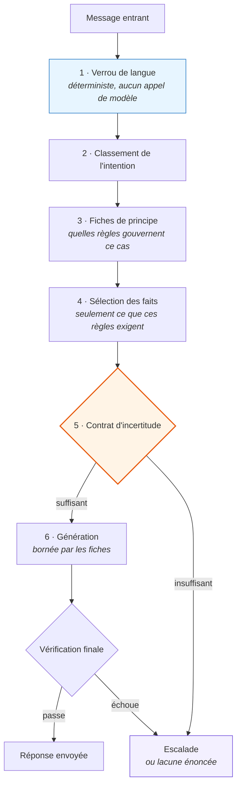

# 03 · La pile de raisonnement

Six couches entre un message entrant et une réponse envoyée. Chacune peut
interrompre la suite, et l'interruption est une issue prévue plutôt qu'une panne.

L'ordre est délibéré : **les vérifications les moins chères et les plus
déterministes passent en premier.** Quand un modèle entre en jeu, la langue est
fixée, l'intention est connue, et l'ensemble des faits admissibles est déjà
restreint.



---

## Couche 1 · Verrou de langue

Passe en premier, **sans aucun appel de modèle.** Le pointage est de
l'arithmétique sur le texte brut.

```python
def resolve(message: str, session_language: str) -> str:
    """La langue dans laquelle CETTE réponse doit être écrite.

    Un signal clair l'emporte sur la session — un client qui écrit en français
    demande du français. Un message ambigu conserve la session, ce qui empêche
    la langue de vaciller sur « oui » ou « ok ».
    """
    current = session_language or FR
    clear = detect(message)
    return clear or current
```

Trois décisions de conception tiennent dans huit lignes.

**Les accents comptent double.** Ils sont décisifs et peu coûteux : un seul
caractère accentué est une preuve plus forte que plusieurs mots ambigus.

**Le français québécois sans accents est pointé explicitement.** Les vrais clients
écrivent `sac a dos`, `boite a lunch`, `garantie a vie`. Un détecteur bâti sur les
accents seuls lit cela comme de l'anglais et répond dans la mauvaise langue. La
liste d'expressions existe parce que la panne a eu lieu, pas parce qu'on l'avait
prévue.

**Une entrée ambiguë conserve la langue de la session.** Un message sans signal
clair — `ok`, `merci`, un simple numéro de modèle — n'a pas le droit de changer
quoi que ce soit. Sans cette règle, la langue vacille en pleine conversation, ce
qui est la chose la plus mécanique qu'un agent bilingue puisse faire.

**Pourquoi déterministe.** La langue se vérifie, coûte peu et revient à chaque
tour. Y consacrer un appel de modèle ajouterait de la latence partout et
introduirait de la variance dans une question qui a une bonne réponse. Même
principe que dans
[Partie I · Les garde-fous](https://github.com/Lavrik-nova/claude-code-and-agent-architecture/blob/main/docs/part1/05-gates.md) 🇬🇧 :
mettre la décision dans le code là où le code peut décider.

---

## Couche 2 · Classement de l'intention

Associe le message à un petit ensemble d'intentions et d'étiquettes. C'est ici que
le cas « deux questions dans une phrase » de
[02](02-pourquoi-les-scenarios-echouent.md) cesse d'être un problème de choix de
branche : la sortie est un ensemble, pas un choix.

Les étiquettes produites ici servent à la couche 4 pour faire remonter des faits
qu'aucun principe n'a explicitement demandés mais que le sujet touche clairement.

---

## Couche 3 · Fiches de principe — la partie qui fait réfléchir

C'est la structure centrale. Vingt-cinq fiches, chacune une petite règle
gouvernée, avec douze champs :

```jsonc
{
  "id": "…",
  "title": "…",
  "source": "d'où vient cette règle",
  "approval_status": "approved | approved_locked",
  "channel_scope": "clavardage | messagerie | les deux",
  "triggers": ["ce qui active la fiche"],
  "known_facts": ["les faits dont la règle dépend"],
  "allowed_action": "ce qui est permis sous cette règle",
  "forbidden_action": "ce qui n'est jamais permis sous elle",
  "uncertainty_rule": "quoi faire quand les entrées sont insuffisantes",
  "next_step_class": "le type de geste qui vient ensuite",
  "exceptions": ["là où la règle ne tient pas"]
}
```

Quatre de ces champs font la différence entre un jeu de règles et une structure de
raisonnement.

**`forbidden_action`.** Énoncer ce qui est permis ne suffit pas : un modèle à qui
l'on ne donne que des permissions trouvera des comportements voisins que personne
n'a envisagés. Les interdictions sont portées explicitement, par règle, à côté de
la permission.

**`uncertainty_rule`.** *Par fiche, pas globalement.* Que faire d'une information
manquante n'est pas la même chose pour une question de garantie et pour une
question de stock : l'une ne doit pas deviner du tout, l'autre peut offrir une
réponse nuancée. Un seuil de confiance global ne peut pas exprimer cela — c'est
pourquoi les systèmes qui en utilisent un finissent trop prudents partout ou trop
assurés partout.

**`exceptions`.** Là où la règle ne tient pas. Les limites sont l'endroit où
vivent les pannes — et **7 fiches sur 25 seulement en portent une aujourd'hui.**
Les dix-huit autres ont été écrites comme des règles sans limites énoncées, ce qui
signifie, selon mon propre argument, qu'elles n'ont pas été pensées jusqu'au bout.
Le champ existe et il est sous-utilisé. C'est un arriéré, pas une conception.

**`approval_status` et `channel_scope`.** Une fiche n'est pas vivante parce que
quelqu'un l'a écrite. Elle l'est parce qu'elle a été approuvée, et elle s'applique
aux canaux pour lesquels elle a été portée.

### Les fiches, en chiffres

| | |
|---|---|
| Fiches de principe | 25 |
| Faits | 27 |
| Valeurs distinctes d'`uncertainty_rule` | 24 sur 25 |
| Fiches avec un `forbidden_action` non vide | 25 sur 25 |
| Fiches avec des `exceptions` énoncées | **7 sur 25** |
| États d'approbation en usage | `approved` (15), `approved_locked` (10) |
| Fiches en brouillon | 0 |
| Portée | 20 tous canaux, 5 clavardage seulement |
| Déclencheurs par fiche, en moyenne | 2,1 |

`approved_locked` est un second palier d'approbation : des fiches qu'on ne peut
pas modifier sans déverrouillage explicite. Il couvre les règles où une mauvaise
modification produit un engagement que l'entreprise doit honorer — le langage de
garantie, et tout ce sur quoi un client agirait raisonnablement.

Deux chiffres de ce tableau sont inconfortables et les deux restent. Sept sur
vingt-cinq pour les `exceptions` est une brèche. Zéro brouillon signifie que
**l'étape de révision n'a jamais refusé une fiche** — ce qui est soit de la
discipline en amont, soit une révision qui n'a pas encore été mise à l'épreuve.
Je ne sais pas laquelle des deux, et le dire est plus utile que de choisir la
lecture flatteuse.

---

## Couche 4 · Sélection des faits

Vingt-sept faits existent. Une réponse donnée en voit une poignée.

```python
def select_facts(cards: list, intent: dict) -> list:
    """Seulement les faits dont les principes retenus ont besoin,
    plus les correspondances d'étiquettes."""
    wanted = {fid for c in cards for fid in c.get("known_facts", [])}
    by_id = {f["id"]: f for f in facts()}
    out = [by_id[fid] for fid in sorted(wanted) if fid in by_id]
    have = {f["id"] for f in out}
    for f in facts():
        if f["id"] not in have and set(f.get("tags", [])) & set(intent["tags"]):
            out.append(f)
    return out
```

Deux passes : les faits que les principes actifs ont déclarés nécessaires, puis
les faits dont les étiquettes correspondent à l'intention même si aucun principe
ne les a demandés.

**Pourquoi ne pas tout envoyer.** Vingt-sept faits, c'est assez peu pour tenir en
entier dans une invite. C'est quand même une erreur. La matière non pertinente ne
reste pas inerte : elle dilue la matière pertinente et donne au modèle la
permission d'aller chercher quelque chose qui ne s'applique pas. La sélection est
un mécanisme de qualité qui se trouve aussi être moins cher.

---

## Couche 5 · Le contrat d'incertitude — et une limite honnête

C'est la couche où je dois être précis, parce qu'une version antérieure de ce
document a surestimé les choses et qu'un relecteur l'a relevé.

**Ce que c'est.** Chaque fiche porte un `uncertainty_rule` : quoi faire quand les
entrées dont cette règle dépend ne sont pas là. Poser une question ciblée, donner
une réponse partielle nuancée, ou passer la main. Il arrive avec la fiche, il est
attaché à cette règle, et c'est une donnée — révisable, comparable, approuvée
individuellement.

**À quel point c'est réellement spécifique.** Vingt-cinq fiches portent **24
valeurs distinctes**. Ce n'est pas un gabarit répété avec un champ rempli ; c'est
près d'une décision délibérée par règle.

**Ce que ce n'est pas.** Ce n'est **pas une barrière déterministe.** Aucune
fonction de ce code n'évalue la couverture des faits pour bloquer la génération.
Le contrat est exprimé en données et exécuté par le modèle.

La distinction compte et je ne vais pas la brouiller. L'argument contre une note
de confiance produite après coup — un modèle qui évalue sa propre sortie, c'est le
même processus qui se juge — vaut ici aussi, simplement plus tôt et avec de
meilleures entrées. Poser la question avant la génération et l'attacher à chaque
règle rétrécit l'angle mort. Cela ne l'élimine pas.

**Ce qui en ferait une vraie barrière.** Une vérification de couverture
déterministe : pour les fiches actives, tous les `known_facts` sont-ils présents
dans l'ensemble sélectionné ? Sinon, le `next_step_class` est imposé sans
consulter le modèle. C'est une petite fonction sur des données que le système
possède déjà — une quarantaine de lignes. Elle n'est pas écrite, et tant qu'elle
ne l'est pas, cette couche est un contrat solide plutôt qu'un contrôle.

Selon la norme employée partout dans ce dépôt — *un contrôle doit être du code, un
drapeau ou un test* — cette couche ne qualifie pas encore. Le dire est la raison
d'avoir une norme.

### Ce qui est déterministe aujourd'hui

Pour lever le même doute, voici ce qui est du code et vérifiable dans les sources :

| Mécanisme | Déterministe |
|---|---|
| Résolution de la langue (couche 1) | Oui — arithmétique, aucun appel de modèle |
| Sélection des faits (couche 4) | Oui — opérations d'ensembles sur des dépendances déclarées |
| Filtre de révision et d'activation à la récupération | Oui — imposé dans le prédicat SQL |
| Exclusion de types de mémoire par canal | Oui — filtrée au niveau de la requête |
| Arrêt total de la réconciliation à la moindre erreur | Oui |
| Classement du statut de réponse, fil par fil | Oui |
| Le contrat d'incertitude (couche 5) | **Non — contrat en données, exécuté par le modèle** |

---

## Couche 6 · Génération, bornée

Le modèle écrit la réponse. Ce qu'il a le droit d'écrire est déjà contraint par
les fiches : l'action permise, les interdictions, le ton, les faits qu'il peut
citer, et la classe de geste suivant qu'il peut proposer.

L'invite système n'est pas l'endroit où vivent les règles. C'est l'endroit où vit
la voix. Les règles vivent dans les fiches, et les fiches sont des données —
révisables, comparables, approuvées une par une, portées par canal. Une règle qui
vit dans une invite ne peut être aucune de ces choses.

---

## Vérification finale, et la règle qui l'a produite

Après la génération, une passe de vérification précède l'envoi. Son existence
découle directement d'une règle apprise à la dure, aujourd'hui inscrite dans les
consignes du critique lui-même :

> Ne jamais proposer de corriger un comportement en ajoutant des mots à une
> invite. Sur ce projet, cela a été annulé trois fois ; un contrôle doit être du
> code, un drapeau ou un test.

Trois retours en arrière. Chaque fois, le correctif le plus rapide — ajouter une
phrase à l'invite — a tenu jusqu'à l'entrée inhabituelle suivante, puis a lâché en
silence. Ce qui a fonctionné, c'est de déplacer la contrainte à un endroit qui ne
dépend pas de la coopération du modèle.

Un de ces cas est raconté en entier dans
[09 · Ce que la mesure a trouvé](09-ce-que-la-mesure-a-trouve.md).

---

**Suite :** [04 · La connaissance produit](04-connaissance-produit.md)
