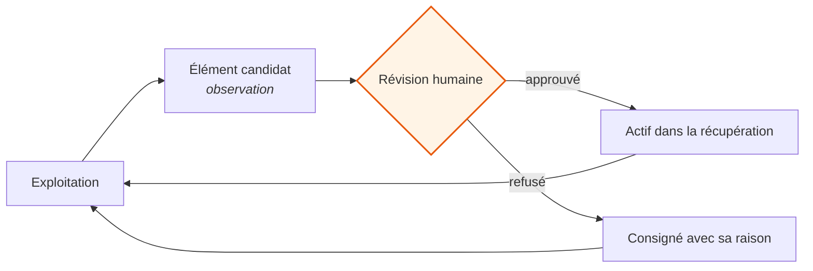

# 05 · Une mémoire qui reste orientée

Le catalogue change. Des produits sont discontinués, des couleurs disparaissent,
des spécifications sont corrigées, le site est modifié par quelqu'un qui ignore
qu'un agent le lit.

Un agent dont la connaissance est un instantané est juste le jour de sa mise en
service et se dégrade ensuite, invisiblement, parce qu'une réponse périmée
ressemble exactement à une réponse fraîche. Ce document porte sur la façon dont la
connaissance se met à jour et dont l'agent reste juste pendant qu'elle bouge.

---

## Trois états, pas deux

Le modèle naïf est *présent* ou *absent*. La réalité a un troisième état qui porte
l'essentiel du risque.

| État | Signification | Comportement de l'agent |
|---|---|---|
| **Actif** | Vu à la dernière synchronisation, confirmé | Répondre normalement |
| **Périmé** | Pas vu récemment, disparition non confirmée | Répondre en énonçant la lacune, ou vérifier |
| **Absent** | Retrait confirmé | Ne pas le proposer |

L'état du milieu est toute la conception. Le replier sur « absent » fait nier des
produits qui existent. Le replier sur « actif » fait vendre des produits qui
n'existent plus. Aucune des deux erreurs n'est rattrapable au moment de répondre,
donc la distinction doit survivre depuis la synchronisation jusqu'à la couche de
raisonnement.

---

## La règle qui empêche un catalogue plein de fausses disparitions

```python
def reconcile(seen: set, errors=(), now: float = None, verify=None) -> dict:
    """Consigner quelles lignes stockées le balayage n'a PAS vues.
    Ne supprime jamais rien.

    Un balayage qui a rencontré LA MOINDRE erreur ne réconcilie RIEN. Un demi-
    balayage qui déclare « ces 19 produits ont disparu », c'est ainsi qu'une
    panne de récupération devient un catalogue plein de fausses morts ; et
    `sync_now` renvoie déjà « ok » sur un balayage partiel : une page qui
    s'analyse en {} est écartée sans consigner d'erreur, donc `errors`
    sous-estime les dégâts au lieu de les surestimer.
    """
```

Trois protections distinctes dans une seule fonction.

**Ne supprime jamais rien.** L'absence lors d'un balayage est un indice, pas une
preuve. Les lignes sont marquées, jamais retirées : une conclusion erronée reste
réversible et visible.

**La moindre erreur annule toute la réconciliation.** Pas « réconcilier les
parties qui ont fonctionné ». Un balayage partiel qui signale dix-neuf produits
manquants est indiscernable de dix-neuf produits réellement discontinués, et agir
dessus corrompt le catalogue d'une manière qui prend des semaines à remarquer.

**Le signal d'erreur est supposé sous-estimer les dégâts.** Le commentaire dit
explicitement qu'une page qui s'analyse en vide est écartée sans consigner
d'erreur. Le seuil n'est donc pas « peu d'erreurs, on continue » — c'est
*n'importe quelle* erreur, on arrête. Concevoir contre un signal qu'on sait
optimiste est la différence entre une vérification et une formalité.

---

## Comment l'agent reste orienté pendant que la base bouge

Quatre mécanismes, chacun bouchant une brèche différente.

**Le statut de révision est une donnée, pas une convention.** Chaque page et
chaque élément de mémoire porte un état d'approbation explicite, et la requête de
récupération filtre dessus — voir
[04 · La connaissance produit](04-connaissance-produit.md). Une connaissance
nouvelle est inerte tant qu'elle n'est pas approuvée. Il n'existe pas de fenêtre
pendant laquelle une page non révisée est vivante parce que quelqu'un a sauté une
étape.

**La fraîcheur participe au classement.** La récupération trie par pertinence puis
par date de mise à jour. Entre deux pages également pertinentes, la plus récemment
confirmée gagne. Cela ne règle pas la péremption ; cela empêche la plus vieille
version d'un fait de gagner par chance lexicale.

**Les types sont séparés pour que les contradictions apparaissent.** Connaissance
organisée et éléments appris vivent dans des dépôts différents, avec des
disciplines de révision différentes. Quand un élément appris contredit une page
organisée, le conflit est visible en tant que conflit au lieu de se résoudre en
silence en faveur du premier récupéré.

**Le remplacement est explicite.** Quand un fait est corrigé, les deux versions
sont gardées, l'ancienne est marquée remplacée, et la raison pour laquelle la
nouvelle l'emporte est consignée. Cela coûte un paragraphe et achète la capacité
d'annuler le changement plus tard — ce qui compte, parce qu'environ une correction
sur dix est elle-même fausse.

---

## La boucle d'auto-amélioration, et sa limite ferme

L'exploitation produit de la matière : des dossiers qui se sont mal passés, des
motifs qui reviennent, des corrections apportées à la main par un humain. Cette
matière est une connaissance candidate.



**L'étape de révision n'est pas automatisable ici, et je ne l'ai pas automatisée.**

Un agent qui écrit sa propre connaissance durable sans révision n'est pas un
système plus mûr. C'est un système avec un mode de panne plus discret : un élément
faux entre, il est récupéré, il façonne des réponses, et il se renforce parce que
les réponses qu'il a façonnées paraissent cohérentes. Quand on s'en aperçoit, la
base contient plusieurs générations d'erreur assurée et il n'y a plus de point de
retour propre.

À cette échelle, la révision coûte quelques minutes par semaine. Le coût de son
absence est illimité et n'est pas détectable tôt. L'arbitrage n'est pas serré.

**Les éléments sont typés plutôt que filtrés.** Une observation non confirmée
n'est pas jetée — jeter les hypothèses oblige à les redécouvrir. Elle est rangée
comme observation et n'a pas le droit d'être présentée comme un fait. La
distinction vit dans le modèle de données, donc elle ne peut pas s'éroder.

---

## Ce qui a fait naître ces règles

Un épisode mérite d'être dit franchement, parce que c'est ce qu'il y a de plus
utile dans ce document.

La logique de réconciliation vivait à l'origine à l'intérieur de la fonction de
synchronisation. La seule façon de la tester était de réimplémenter la même
logique dans le test. **Un critique adverse aveugle — un relecteur à qui l'on
donne le changement mais pas l'historique des décisions du projet — a fait
remarquer que le test restait au vert quand le vrai seuil changeait.** Le test
exerçait une copie. Il ne prouvait rien sur le code qui tourne.

Le correctif était structurel : extraire la logique dans une fonction appelable
séparément, pour que le test exerce l'original.

Deux conséquences, devenues des pratiques permanentes.

**Un test qui exerce une réimplémentation est pire que pas de test**, parce qu'il
annonce une confiance qu'il n'a pas gagnée.

**Le critique doit être aveugle.** Un relecteur qui détient le registre des
décisions rationalise : il suppose qu'un choix étrange était délibéré. Celui qui
ne l'a pas demande pourquoi, et les fois où il a tort sont peu coûteuses. Ses
propres consignes portent la prudence correspondante — *si quelque chose paraît
faux mais pourrait être une décision délibérée du propriétaire, dites-le
explicitement au lieu de l'affirmer.*

Un second épisode, où le même critique a bloqué une couche dont les 44 tests
étaient verts, est raconté dans
[09 · Ce que la mesure a trouvé](09-ce-que-la-mesure-a-trouve.md).

---

**Suite :** [06 · Limites et passage à l'humain](06-limites-et-passage.md)
